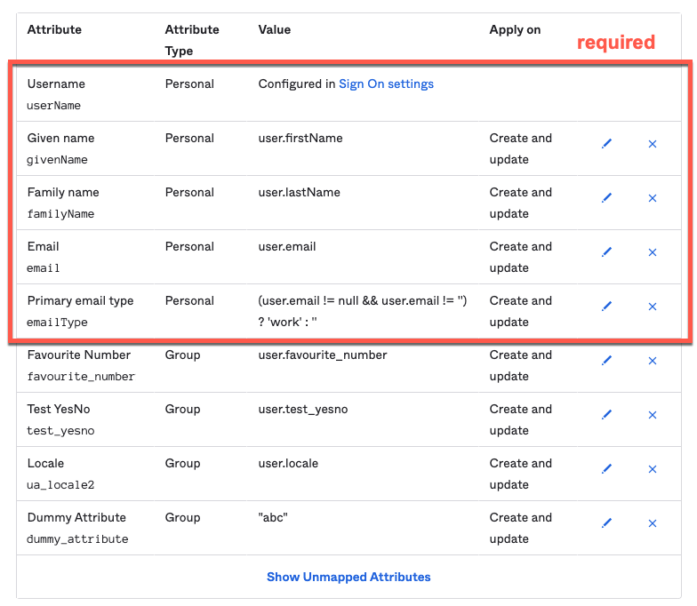

# Configure Okta

## Create SAML app integration

First set up a SAML app for Looker, configure the user attribute mappings, and assign the app to users. You'll also probably want to put users in different groups. If you already have a SAML app integrated with Looker, skip to the next section.

> You must create a custom app integration for Looker. Do not use the [Looker app](https://saml-doc.okta.com/SAML_Docs/How-to-Configure-SAML-2.0-for-Looker.html) from the App Integration Catalog as it does not support SCIM.

1. If you don't have an Okta account, you can sign up [here](https://developer.okta.com/signup/) for a free developer account.
1. Create a new app integration with the `SAML 2.0` sign-in method.
1. Follow the [Looker documentation](https://docs.looker.com/admin-options/security/saml-auth) to connect to Looker

## Connect Okta to SCIM server

Then [follow these steps](https://help.okta.com/en/prod/Content/Topics/Apps/Apps_App_Integration_Wizard_SCIM.htm) to enable provisioning for your Looker application.

- Base URL: `{{your_domain}}/scim/v2`
- Unique identifier field for users: email
- Enable supported actions:
  - Push New Users
  - Push Profile Updates
  - Push Groups
- Authentication Mode: HTTP Header
  - Paste in a generated auth token
- Enable "Create Users", "Update User Attributes", and "Deactivate Users"
- Remove **all** unused attributes to prevent Okta from sending unnecessary requests to the SCIM server
  - The minimum required attributes are: `userName`, `givenName`, `familyName`, `email`, and `emailType`
  - Here's an example mapping including some additional user attributes:
    

## Syncing Existing Looker Users

**If users already exist in Looker, users will need to be synced twice**

1. Assign users to the SAML app for Looker
   - Okta will send a GET request to lookup the user(s) via email. Since the user exists in Looker, but does not exist in the scim DB (we want to store the external_id along with the looker_id together), the scim server will return an empty response with 200
   - Okta will then try to POST the user with the user’s details
   - The scim server will write the details of the looker_id, external_id, and email, then return a 409 stating that the resource user record is already in looker
1. Now that the user is in the scim db, we can try and assign the user(s) again
   - Use the admin/tasks in Okta to retry provisioning the user(s)
   - Okta will send a GET request to lookup the user(s) via email and the scim server will return the user object
   - Okta will issue a PUT request to update the user(s). The scim server will make any updates and return a 200
1. The user(s) are now synced in Okta, scim server, and Looker

## [Optional] User Attributes

1. Create an attribute if one does not already exist:

   - Applications > SCIM App > Provisioning > "To App" > "Go to Profile Editor"
   - click "Add Attribute"
   - enter data type and configurations, e.g.:
     ```
     Data type: number
     Display name: Favourite Number # used in Okta
     Variable name: favourite_number # used in Okta
     External name: favourite_number # exact name of UA in Looker
     External namespace: urn:ietf:params:scim:schemas:extension:LookerUserAttributes:2.0:User # schema and property containing all UAs as key:value pairs
     ```
   - make sure to use the same names as used in Looker. The external namespace _must_ be `urn:ietf:params:scim:schemas:extension:LookerUserAttributes:2.0:User`
   - Note: to use `locale`, make a duplicate attribute with a different variable name

1. Map attribute to SCIM server

   - Go back to Provisioning > "To App"
   - click "Show Unmapped Attributes"
   - map the attribute from Okta profile, apply on "Create and update"

1. When assigning Groups to SCIM server, attributes can be set at group level which will override attributes set at the user level. The SCIM server will only send Looker a single value

Refer to [`docs/schema-examples`](schema-examples.md) for more details on the user and group objects.
